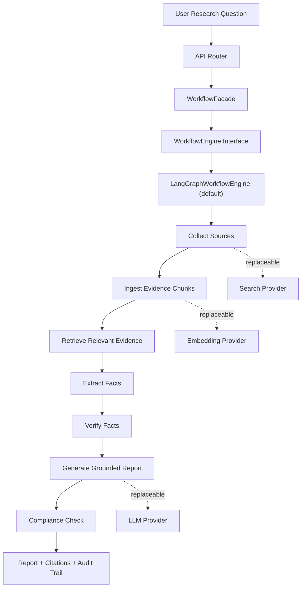

# Verifiable Company Research Agent

可溯源企业公开信息研究智能体

An open-source MVP / reference implementation for company research over public information. 本项目定位为开源 MVP / reference implementation. It focuses on evidence-first output: collected sources, evidence chunks, extracted facts, verification status, grounded reports, citations, and compliance checks.

This project is **not investment advice**. 本项目不提供投资建议。It is not a production investment research system and does not provide stock recommendations, buy/sell guidance, target prices, return forecasts, portfolio advice, or personalized investment advice.

## Why This Project?

Many research-agent demos jump straight from a question to a fluent answer. This project keeps the intermediate research trail visible:

- sources are collected through replaceable search providers;
- evidence is chunked, embedded, retrieved, and attached to citations;
- facts are extracted and verified before report assembly;
- compliance checks run before report/chat output;
- provider and workflow-engine boundaries are explicit.

The default local route is intentionally offline: `mock + local_documents + local_hashing`. You can run the project without external API keys.

## Highlights

- **Evidence-first reports**: citations point back to source/chunk metadata.
- **Provider-neutral design**: provider 可替换；LLM, search, embedding, and vector store implementations are selected behind interfaces.
- **Replaceable workflow engine**: LangGraph is the default workflow engine, not the project name and not a hard architectural lock-in.
- **Local-first startup**: `.env.example` uses local/mock providers and blank key fields.
- **Compliance boundary**: report and chat outputs are checked against non-investment-advice rules.
- **Regression-only real-company samples**: fixed public-company cases live only under `data/eval/*`, `docs/evaluation_cases.md`, and `scripts/run_public_company_regression.py`. 这些样例用于链路回归，不代表系统绑定特定企业。

## Demo Screenshots

No real screenshots are bundled in this release. Optional future assets are documented in `docs/assets/README.md`:

- `demo-report.png`: report page with grounded output;
- `evidence-citations.png`: citations, sources, and verification view;
- `workflow-overview.png`: architecture or workflow overview.

## Architecture Overview



The optional real-provider smoke example uses DeepSeek, Baidu AI Search, and DashScope. 这只是可选真实链路示例，不是架构限制。The system is designed around provider interfaces, not a single vendor stack.

## Quick Start

Shortest local route with no external keys:

```powershell
Copy-Item .env.example .env
docker compose -p vcra up -d --build --force-recreate
```

Open:

- Frontend: `http://localhost:5173`
- Backend OpenAPI: `http://localhost:8000/docs`

Health checks:

```powershell
Invoke-RestMethod http://localhost:8000/api/health
Invoke-RestMethod http://localhost:8000/health/providers
```

Stop:

```powershell
docker compose -p vcra down
```

For Python/npm local development, use `docs/windows_quickstart.md`. For validation commands, use `docs/testing_guide.md`.

## Real Provider Smoke Test

Real providers are optional. Use them only after the offline route works.

1. Copy `.env.example` to local `.env`.
2. Copy only the needed provider fields from `.env.providers.example` into `.env`.
3. Put real keys only in local `.env`; never write them into `.env.example`, docs, screenshots, commits, or issues.
4. Restart the backend after changing `.env`.

Recommended smoke settings:

```text
LLM_PROVIDER=deepseek
DEEPSEEK_MODEL=deepseek-chat
SEARCH_PROVIDER=baidu_ai_search
EMBEDDING_PROVIDER=dashscope
WORKFLOW_ENGINE=langgraph
```

Notes:

- `deepseek-chat` is the recommended smoke model. `deepseek-v4-flash` is optional but may return reasoning-only responses for some prompts.
- `BAIDU_AI_SEARCH_MODEL` must be a chat model enabled for your account.
- If Baidu AI Search returns weak or unusable references, the workflow may surface insufficient evidence instead of forcing a conclusion.
- PowerShell environment variables can override `.env` for the current terminal.
- The `local_documents` route can only answer from files under `data/imports`; do not expect it to research a real company unless you have imported relevant public documents.

Smoke script:

```powershell
.\.venv\Scripts\python scripts\verify_real_chain.py --base-url http://localhost:8000
```

If your backend runs on another port, pass the matching `--base-url` or set `VERIFY_BASE_URL`.

Detailed real-chain steps are in `docs/testing_guide.md`, `docs/demo_walkthrough.md`, and `docs/provider_boundary.md`.

## Project Boundaries

- This is an open-source MVP / reference implementation, not a production system.
- It does not provide investment advice, ratings, recommendations, target prices, return forecasts, or portfolio guidance.
- `mock` and `local_hashing` are dev/test providers; they do not prove real search or semantic embedding quality.
- `in_memory` / SQLite vector stores are local MVP implementations, not production vector databases.
- Fact extraction, verification, and compliance are rule-oriented MVP components.
- External-provider quality depends on upstream search results, model access, network stability, page fetchability, and PDF/table parsing.
- LangGraph is the default workflow engine; `WORKFLOW_ENGINE=service` remains only as a legacy fallback.

## Documentation Index

- `docs/README.md`: documentation map.
- `docs/windows_quickstart.md`: Windows local startup and port troubleshooting.
- `docs/testing_guide.md`: pytest, ruff, frontend build, secret scan, and regression commands.
- `docs/demo_walkthrough.md`: demo task flow and citation/source checks.
- `docs/provider_boundary.md`: replaceable provider boundaries and real-provider troubleshooting.
- `docs/evaluation_cases.md`: fixed regression cases and their limits.
- `docs/architecture.md`: module boundaries.
- `docs/workflow.md`: workflow-engine design.
- `docs/compliance.md`: non-investment-advice guardrails.

## License

MIT License. See `LICENSE`.
