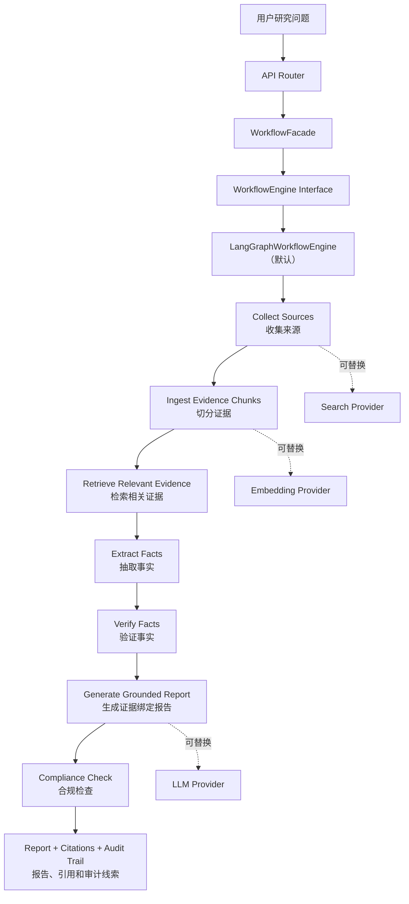

# Verifiable Company Research Agent

可溯源企业公开信息研究智能体

[](https://opensource.org/licenses/MIT)

> **GitHub**: [Yaoniguan-Money/Verifiable-Company-Research-Agent](https://github.com/Yaoniguan-Money/Verifiable-Company-Research-Agent)

本项目是一个面向企业公开信息研究的开源 MVP / reference implementation。它强调 **evidence-first（证据优先）**：先收集来源、切分证据、抽取事实、做验证，再生成带 citations 的报告，并在输出前做合规检查。

本项目不提供投资建议。它不是生产级投研系统，也不提供荐股、买入/卖出建议、目标价、收益预测、持仓建议、评级或个性化投资建议。

## 为什么做这个项目？

很多研究类 agent demo 会直接从问题跳到一段流畅回答，但中间证据链不透明。本项目更关注“回答是怎么来的”：

- 通过可替换 search provider 收集公开资料；
- 将来源文本切成 evidence chunks，并用于检索和引用；
- 在生成报告前抽取 facts，并对 facts 做 verification；
- 报告和追问输出前经过 compliance check；
- provider 可替换，workflow engine 也可替换，边界明确。

默认搜索路线是联网公开来源：`mock + public_sources + local_hashing`。`public_sources` 默认访问 CNINFO 等公开来源，不需要外部厂商 API key；如配置 `BAIDU_AI_SEARCH_API_KEY` 会叠加 Baidu AI Search。LLM 默认仍为 `mock`，避免无意产生外部 API 调用费用。

## 项目亮点

- **证据优先报告**：报告中的 citations 可回查到 source/chunk 元数据。核心发现可直接追溯到年报原文段落。
- **Provider-neutral 设计**：LLM、Search、Embedding、Vector Store、Reranker 均通过接口选择实现，配置驱动切换。
- **可替换 workflow engine**：LangGraph 是默认 workflow engine，16 节点 StateGraph 可扩展。
- **默认联网搜索**：`public_sources` 默认访问 CNINFO 等公开来源，不需要外部 API key。
- **Hybrid RAG 检索**：Dense + BM25 + RRF 融合 + Reranker 重排，支持 ONNX/Embedding/Lexical 三后端可切换。
- **LLM 增强事实抽取**：正则表格抽取 + LLM 语义抽取双链路。LLM 通过 Embedding 排序后依次送检、意图命中即停，补齐叙述句中的关键财务数字。
- **分层校验体系**：LLM 事实置信度=1.0 直通 verified，正则事实走 cross-source 交叉验证。单位归一化消除元/亿元虚假冲突。
- **财务指标精细区分**：研发费用(R&D_expenditure) vs 研发投入合计(R&D_total_spending)、净利润 vs 归母净利润 vs 扣非净利润，独立指标独立校验。
- **双公司对比分析**：并行执行两个独立研究工作流，对比同一指标差异。
- **合规边界清楚**：报告和 chat 输出会检查非投顾边界。
- **实时特性开关**：前端设置页切换功能即时生效并持久化到 .env，无需重启。

## Demo 截图

当前 release 不包含真实截图，也不会放假截图。

未来如果补截图，建议放在 `docs/assets/`，并参考 `docs/assets/README.md`：

- `demo-report.png`：报告页面截图；
- `evidence-citations.png`：citations / sources / verification 截图；
- `workflow-overview.png`：架构图或 workflow 图。

## 架构概览



可选真实链路示例使用 DeepSeek、Baidu AI Search 和 DashScope。这只是可选真实链路示例，不是架构限制。业务层依赖 provider 接口，不绑定单一厂商。

## 技术栈与工程架构

**后端与 API**

- Python + FastAPI：提供 research task、report、sources、facts、verification、chat 等 HTTP API。
- Pydantic：定义 API schema、workflow state、fact / source / verification / report 数据结构。
- SQLAlchemy + SQLite：管理 task、source、evidence chunk、fact、verification、report、message、memory 等本地持久化数据。
- Repository / Service 分层：API Router 只处理 HTTP；业务逻辑放在 services / workflows；数据库访问封装在 repositories。

**Workflow 编排**

- LangGraph `StateGraph`：默认 workflow engine，用显式节点和 conditional edges 表达研究流程、证据不足分支、verification review 分支、compliance rewrite / block 分支。
- WorkflowEngine Interface：通过接口隔离 workflow 实现，避免 API 层绑定 LangGraph。
- WorkflowFacade + ResearchDomainServices：API 层只创建任务和读取结果，图节点只负责状态流转，provider 调用、证据规则、报告组装和持久化放在 domain services。
- Workflow audit：每个节点记录 step result，关键分支记录 WorkflowDecision，最终报告附带 audit trail。
- ServiceWorkflowEngine：保留为 legacy fallback，用于回归验证，不是主路径。

**RAG / Evidence Pipeline**

- **Source collection**：SearchProvider 收集公开资料，支持本地文档、官方 URL、CNINFO 巨潮公告、Baidu AI Search 等。
- **Content enrichment pipeline**：PDF 下载缓存 → FinancialReportParser (pdfplumber) 结构化解析 → 表格 Markdown 增强 → 章节标注。Web 来源的 PDF 也能受益于结构化解析。
- **Semantic chunking**：SectionAwareChunker（利用章节标注在边界处分块）、RecursiveTextSplitter（按段落/句子递归切分）、FixedWindowChunker（兼容保留），策略可配置。
- **Content prioritization**：IntentDrivenPrioritizer 利用 MetricRegistry 动态生成关联词权重，替代硬编码关键词的 `_focus_report_content` 窗口化。
- **Embedding**：EmbeddingProvider 生成向量，支持 DashScope/SiliconFlow 等真实 Embedding API。
- **Vector store**：PgVector (HNSW 索引 + 无约束维度)、SQLite、InMemory 三种后端，维度校验防 mismatch。
- **Hybrid retrieval**：Dense (DashScope cosine) + Sparse (BM25 缓存) + RRF 融合 (k=60) → Reranker 重排 → Top-K。
- **Reranker 三后端实测**：在中文财报 chunk 检索场景下，ONNX cross-encoder (BAAI/bge-reranker-base) 全面领先——P@5=1.0, MRR=1.0, NDCG@5=1.0；Embedding API (DashScope) P@5=0.40；Lexical Jaccard P@5=0.60。ONNX 仅 527ms 推理延迟（CPU），推荐生产使用。
- **Fact extraction 双链路**：正则表格抽取 (20 条规则 + 状态机) + LLM 语义抽取 (Embedding 排序 → 依次送检 → 意图命中即停)。
- **LLM Prompt 标准化**：metric_name 映射表 (18 个中→英)、period 格式约束、禁止运算/增减幅，后处理归一化兜底。
- **Fact verification 分层**：LLM 事实 (confidence=1.0) 直通 verified；正则事实走 cross-source 交叉验证。单位归一化消除虚假冲突。
- **答案管道**：严格意图过滤 → 首选指标优先 → LLM 事实优先 → 空结果回退 conflicted → 口径差异标注。
- **Citation grounding**：citations 绑定 source_id/chunk_id/title/url/retrieved_at，可逐条回溯。
- **财务指标注册表**：rd/profit/revenue/capacity/business 五大族，每族 preferred_metric 指导答案选择。

**Provider 架构**

- LLM Provider：`mock`、DeepSeek、Qianfan。
- Search Provider：`local_documents`、`official_urls`、`cninfo_announcements`、`public_sources`、Baidu AI Search。
- Embedding Provider：`local_hashing`、DashScope、SiliconFlow 等 OpenAI-compatible provider。
- ProviderFactory：统一创建 provider，真实 provider 缺 key 时直接失败，不隐式 fallback 到 mock。
- Secret-safe settings：Pydantic Settings 使用 `SecretStr` 接收 key，health/provider 输出只暴露 provider 状态、host 或模型标识，不回显 key。

**合规、追问与记忆**

- Compliance guardrail：报告输出和 chat 输出复用合规检查，命中投顾导向内容时 rewrite 或 block。
- Report-grounded follow-up：chat 追问基于已生成报告、facts 和 verification 统计，不把追问变成新的无来源自由回答。
- Chat memory MVP：保存 task session 的 message turn，并通过 watermark / dirty / running 状态做轻量 memory extraction coalescing。
- Memory operations：支持 ADD / UPDATE / DELETE / NOOP 的用户记忆写入模型，当前是 MVP 级实现，不是长期生产记忆系统。

**前端与展示**

- React + Vite + TypeScript：提供本地 demo UI。
- 页面能力：创建研究任务、查看报告、citations、sources、verification、facts，并围绕报告追问。
- 静态 regression panel：展示离线 fixture 回归摘要，只用于说明抽取链路稳定性，不代表真实搜索质量。

**工程质量与交付**

- pytest：覆盖 provider、workflow、RAG、verification、report、API、配置模板和 release 口径。
- ruff：后端和脚本 lint。
- npm typecheck / build：前端类型检查和构建验证。
- GitHub Actions：离线 CI 验证，不依赖真实 API key。
- secret scan：检查 `.env`、真实 key、常见 secret 形态和 Git 历史中的 env 文件。
- Dockerfile + Docker Compose + PowerShell 脚本：支持本地一键启动和 release 验证。

## 技术栈速览

本项目涉及的核心技术点：

- FastAPI 后端 API 设计
- Pydantic schema / typed workflow state
- SQLAlchemy ORM / SQLite 本地持久化
- LangGraph workflow orchestration
- conditional graph routing / workflow audit trail
- WorkflowEngine interface / 可替换编排引擎
- RAG pipeline / evidence ingestion / chunking / retrieval
- CNINFO annual report PDF ingestion
- official source augmentation / source quality gate
- local hashing embedding / OpenAI-compatible embedding provider
- vector store abstraction / SQLite cosine retrieval
- provider abstraction / provider factory / strict runtime validation
- citation grounding / evidence-first report
- financial table extraction / structured fact extraction (20+ rule patterns + state machine)
- LLM-augmented fact extraction (embedding-ranked chunk selection, early termination)
- metric normalization / unit normalization (元/千元/万元/亿元) / fact verification reason codes
- ONNX cross-encoder reranker deployment (BAAI/bge-reranker-base, MRR=1.0)
- Hybrid RAG: Dense + BM25 + RRF + Rerank pipeline
- semantic chunking strategy (section-aware / recursive / fixed-window)
- content prioritization (intent-driven report windowing)
- PgVector HNSW vector store with dynamic dimension
- dual-company parallel compare pipeline
- runtime feature flags with frontend-backend sync + .env persistence
- compliance guardrail / non-investment-advice output control
- report-grounded follow-up chat
- lightweight chat memory / memory operation persistence
- LangFuse observability integration
- secret hygiene scan / release-risk checks
- React + Vite + TypeScript demo UI
- pytest (413 tests, 98.2% pass rate) / ruff / GitHub Actions / Docker Compose

## 快速启动

！！
作者有话说：作者还是学生，条件有限，所以很多方式没办法尝试，目前多种组合实测是外部LLM+外部search+本地ONNX模型最好用，大家可以直接使用这个方式
！！

最短本地启动路线，不需要外部 key；搜索默认会访问公开网络来源：

```powershell
Copy-Item .env.example .env
docker compose -p vcra up -d --build --force-recreate
```

启动后打开：

- 前端：`http://localhost:5173`
- 后端 OpenAPI：`http://localhost:8000/docs`

健康检查：

```powershell
Invoke-RestMethod http://localhost:8000/api/health
Invoke-RestMethod http://localhost:8000/health/providers
```

停止服务：

```powershell
docker compose -p vcra down
```

如果你想用 Python/npm 本地开发，请看 `docs/windows_quickstart.md`。如果你想跑测试、ruff、前端 build 和 secret scan，请看 `docs/testing_guide.md`。

## 真实 Provider Smoke Test

真实 LLM / embedding provider 是可选的。默认搜索已经走 `public_sources` 联网公开来源；如果要使用 DeepSeek、Baidu AI Search 或 DashScope，再按下面配置真实链路。

基本步骤：

1. 复制 `.env.example` 为本地 `.env`。
2. 只从 `.env.providers.example` 复制你需要的 provider 字段到 `.env`。
3. 真实 key 只写进本地 `.env`，不要写进 `.env.example`、文档、截图、commit 或 issue。
4. 修改 `.env` 后需要重启后端。

推荐 smoke 配置：

```text
LLM_PROVIDER=deepseek
DEEPSEEK_MODEL=deepseek-chat
SEARCH_PROVIDER=baidu_ai_search
EMBEDDING_PROVIDER=dashscope
WORKFLOW_ENGINE=langgraph
```

注意事项：

- `deepseek-chat` 是推荐 smoke 模型。`deepseek-v4-flash` 可选，但部分 prompt 可能返回 reasoning-only 内容。
- `BAIDU_AI_SEARCH_MODEL` 必须使用你账号已开通的 chat model。
- 如果 Baidu AI Search 返回低质量或不可用来源，系统可能给出 evidence insufficient / 证据不足，而不是强行下结论。
- PowerShell 当前窗口的环境变量可能覆盖 `.env`。
- `local_documents` 只会读取 `data/imports` 下已有资料；如果没有导入某家真实公司的资料，不要期待它能直接研究该公司。

Smoke 脚本：

```powershell
.\.venv\Scripts\python scripts\verify_real_chain.py --base-url http://localhost:8000
```

如果后端跑在其他端口，请传对应的 `--base-url`，或设置 `VERIFY_BASE_URL`。

更详细的真实链路说明见：

- `docs/testing_guide.md`
- `docs/demo_walkthrough.md`
- `docs/provider_boundary.md`

## 项目边界

- 这些样例用于链路回归，不代表系统绑定特定企业，也不构成投资分析、评级、推荐或建议。
- 当前是开源 MVP / reference implementation，不是生产级系统。
- 不提供投资建议、评级、荐股、买卖建议、目标价、收益预测或持仓指导。
- **数据来源合规**：本项目默认通过 CNINFO（巨潮资讯网）获取 A 股上市公司公开披露信息。巨潮资讯网是中国证监会指定的法定信息披露平台，其公告文件属于法定公开信息。但**自动抓取行为可能违反目标网站的服务条款**，使用者应自行评估合规风险，必要时改用本地导入模式 (`local_documents`) 或将 `SEARCH_PROVIDER` 切换为不依赖第三方抓取的 provider。本项目不提供任何规避网站访问限制的功能，也不对使用者因抓取行为产生的法律后果负责。
- `mock` 和 `local_hashing` 只用于 dev/test，不能证明真实搜索质量或真实语义 embedding 质量。
- `in_memory` / SQLite vector store 是本地 MVP 实现，不是生产级向量数据库。
- fact extraction、verification、compliance 仍是偏规则化的 MVP 组件。
- 外部 provider 效果受上游搜索结果、账号模型权限、网络、页面可抓取性、PDF/表格解析质量影响。
- LangGraph 是默认 workflow engine；`WORKFLOW_ENGINE=service` 仅保留为 legacy fallback。

## 开源协作

- 仓库地址：<https://github.com/Yaoniguan-Money/Verifiable-Company-Research-Agent>
- 贡献说明：`CONTRIBUTING.md`
- 版本变更：`CHANGELOG.md`

## 文档索引

- `docs/README.md`：文档地图。
- `docs/windows_quickstart.md`：Windows 本地启动和端口排障。
- `docs/testing_guide.md`：pytest、ruff、前端 build、secret scan 和回归命令。
- `docs/demo_walkthrough.md`：demo 任务流程、citations 和 sources 检查。
- `docs/provider_boundary.md`：provider 可替换边界和真实 provider 排障。
- `docs/evaluation_cases.md`：固定回归样例及其边界。
- `docs/architecture.md`：模块边界。
- `docs/workflow.md`：workflow engine 设计。
- `docs/compliance.md`：非投顾合规护栏。
- `docs/observability.md`：structlog 与 LangFuse 可选接入。

测试、Benchmark、原始结果与复现方式见 ./evidence/README.md。

## License

MIT License. See `LICENSE`.
